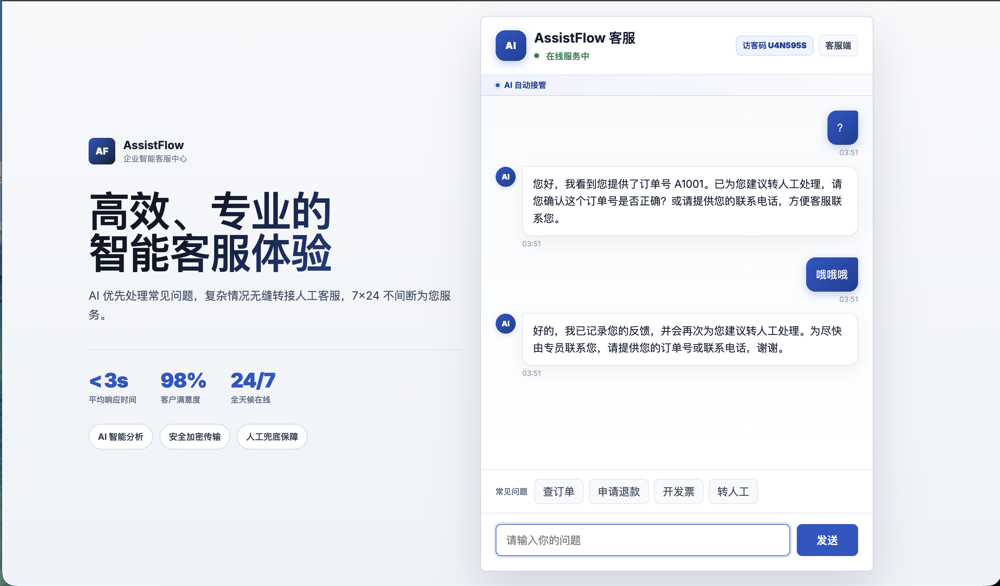
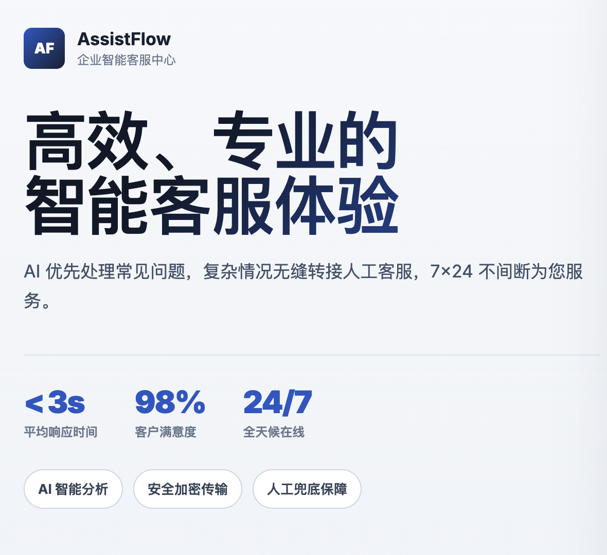
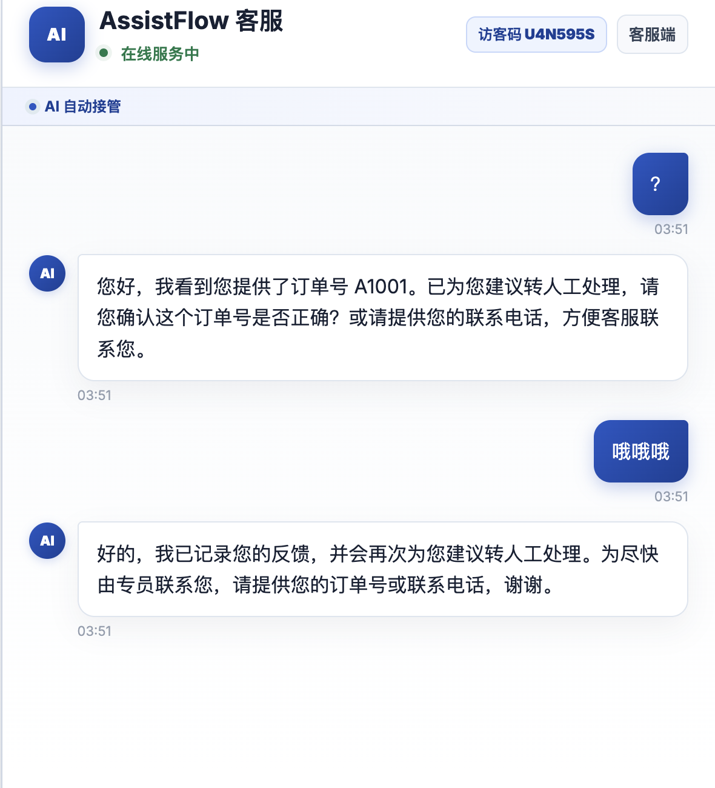
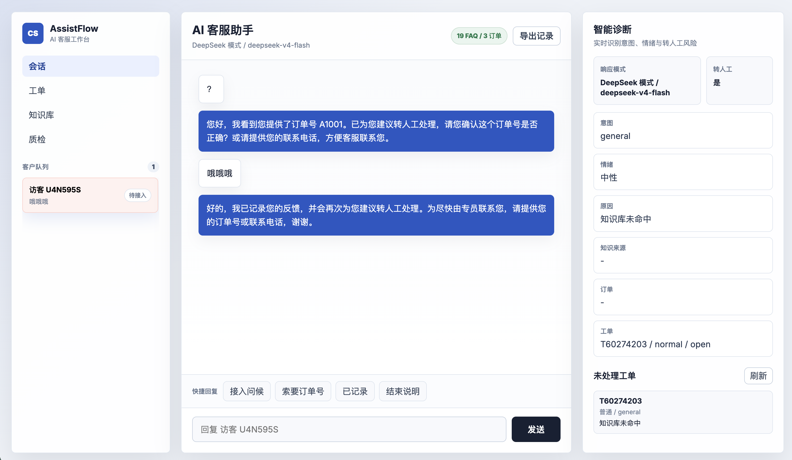
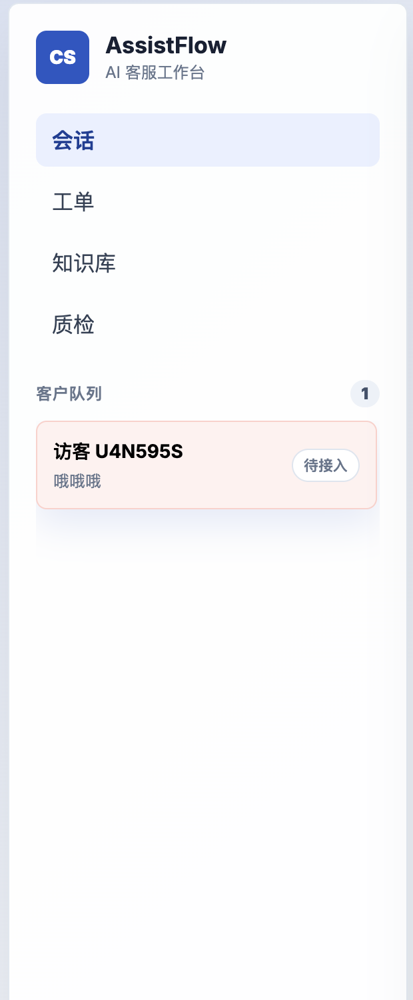
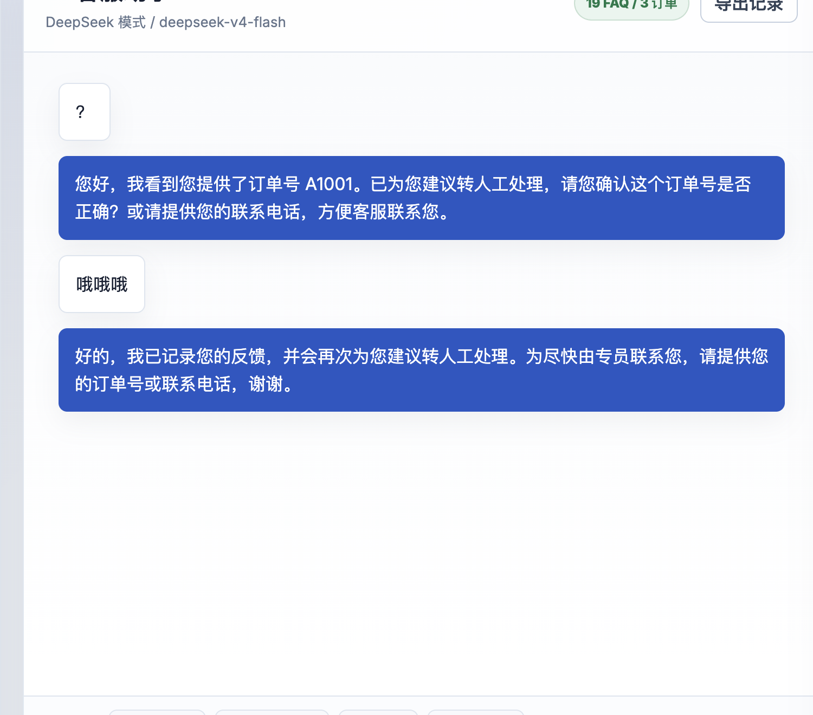
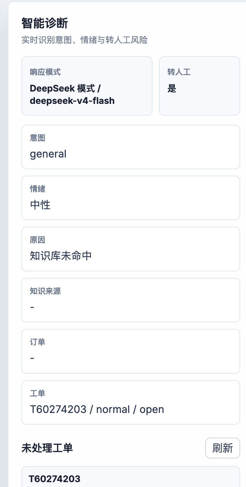

# AssistFlow — AI 智能客服系统

全栈客服 Chat 系统，支持 AI 自动接管、实时人工转接与客服工作台。无 API Key 时自动切换本地规则模式，开箱即用。

## 界面预览

### 客户对话页

客户侧入口面向真实业务咨询场景，支持访客识别、快捷问题、AI 自动响应和人工转接。



客户侧关键区域：

| 品牌与服务承诺 | 对话处理区 |
|----------------|------------|
|  |  |

### 客服工作台

客服侧工作台提供会话队列、聊天记录、AI 诊断、工单状态和快捷回复，便于人工客服接入处理。



工作台关键区域：

| 会话队列 | 人工处理区 | 智能诊断 |
|----------|------------|----------|
|  |  |  |

## 功能

- **AI 自动接管** — 接入 OpenAI（GPT-4o）或 DeepSeek；无 Key 时降级为本地 FAQ 匹配 + 规则引擎
- **智能转人工** — 自动检测负面情绪、投诉关键词、未命中意图，触发人工接入流程
- **实时客服工作台** — SSE 推送会话队列、聊天记录、AI 诊断面板（意图 / 情绪 / 转人工原因）
- **工单系统** — 高优先级会话自动生成工单，支持优先级标记
- **人工接入后 AI 静默** — 人工客服加入会话后，AI 自动停止回复该会话
- **业务数据查询** — 内置示例订单数据，可演示订单状态、退款和售后类问答

## 技术栈

| 层级 | 技术 |
|------|------|
| 服务端 | Node.js + Express 5 |
| AI 集成 | OpenAI SDK（兼容 GPT-4o / DeepSeek） |
| 实时推送 | Server-Sent Events (SSE) |
| 前端 | 原生 JS + CSS，无框架依赖 |

## 项目结构

```
├── server/
│   └── index.js          # Express 服务、AI 调用、会话管理
├── public/
│   ├── index.html        # 客户对话页面
│   ├── agent.html        # 客服工作台
│   ├── customer.js       # 客户端逻辑
│   ├── agent.js          # 工作台逻辑
│   └── styles.css        # 公共样式
├── data/
│   ├── faqs.json         # 知识库（可自行扩展）
│   └── orders.json       # 示例订单数据
├── docs/
│   └── images/           # README 项目截图
├── screenshot/           # 原始截图素材
└── scripts/
    └── smoke-test.js     # 集成冒烟测试
```

## 快速开始

需要 Node.js 18+。

```bash
git clone https://github.com/suijiafeng/ai-customer-support-chat.git
cd ai-customer-support-chat
npm install
cp .env.example .env   # 按需填入 API Key，不填也能运行
npm run dev
```

| 页面 | 地址 |
|------|------|
| 客户对话 | http://localhost:3001 |
| 客服工作台 | http://localhost:3001/agent.html |

## 演示建议

1. 打开客户对话页，输入 `帮我查一下订单 A1001`。
2. 客户侧会收到订单相关回复；如果命中转人工条件，会生成待处理工单。
3. 打开客服工作台，左侧选择新会话，查看聊天记录和 AI 诊断结果。
4. 使用快捷回复或手动输入内容，客服回复后该会话进入人工接入状态，AI 不再自动回复。

可测试订单：

| 订单号 | 场景 |
|--------|------|
| `A1001` | 已发货订单，包含物流信息 |
| `B2026` | 仓库处理中，适合演示发货咨询 |
| `R3308` | 退款审核中，适合演示退款进度 |

## 兼容与容错

- **无 API Key 可运行**：未配置 OpenAI 或 DeepSeek Key 时，服务自动使用本地 FAQ 和规则回复。
- **SSE 降级轮询**：浏览器或代理环境不支持 `EventSource` 时，客户页和客服工作台会自动改用定时轮询。
- **接口异常兜底**：前端会处理非 2xx 响应、非 JSON 响应和网络失败，避免页面直接中断。
- **存储受限兜底**：隐私模式或 WebView 禁用 `localStorage` 时，客户页仍可生成访客码并继续聊天。
- **人工接入保护**：客服回复后，同一会话进入人工处理状态，后续客户消息不再触发 AI 自动回复。

## 环境变量

| 变量 | 默认值 | 说明 |
|------|--------|------|
| `AI_PROVIDER` | `openai` | `openai` 或 `deepseek` |
| `OPENAI_API_KEY` | — | OpenAI API Key |
| `OPENAI_MODEL` | `gpt-4o` | 使用的 OpenAI 模型 |
| `DEEPSEEK_API_KEY` | — | DeepSeek API Key |
| `DEEPSEEK_MODEL` | `deepseek-chat` | 使用的 DeepSeek 模型 |
| `DEEPSEEK_BASE_URL` | `https://api.deepseek.com` | DeepSeek 接口地址 |
| `PORT` | `3001` | 服务监听端口 |

> 不配置 API Key 时，服务以本地规则模式运行，FAQ 匹配和转人工逻辑完整可用。

## 工作流程

```
客户发送消息
     │
意图检测 → 情绪分析 → FAQ 匹配
     │
是否需要转人工？
  ├─ 是 → 创建工单 → SSE 推送客服工作台
  └─ 否 → AI 生成回复（OpenAI / DeepSeek / 本地规则）
```

## API 概览

```
GET  /api/health                    服务状态、模型信息
GET  /api/sessions                  客户会话队列
GET  /api/sessions/events           SSE：队列实时推送
GET  /api/sessions/:id              单个会话详情
GET  /api/sessions/:id/events       SSE：会话实时推送
GET  /api/tickets                   工单列表

POST /api/chat                      客户发送消息（触发 AI / 规则回复）
POST /api/sessions/:id/messages     客服人工回复
```

## 冒烟测试

```bash
npm run dev &
npm run smoke     # 7 个用例，覆盖核心流程
```

## 自定义知识库

编辑 `data/faqs.json`，每条记录格式：

```json
{
  "id": "unique_id",
  "intent": "意图分类",
  "question": "问题描述",
  "answer": "标准回答",
  "keywords": ["关键词1", "关键词2"]
}
```

重启服务后生效。

## 说明

- 会话、工单存储在进程内存中，服务重启后清空
- FAQ 使用关键词 + 字符匹配；如需语义检索可替换为向量数据库
- 无鉴权机制，生产使用前请自行添加
