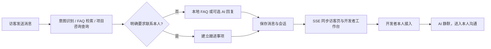

# AssistFlow

独立前端开发者个人主页 AI 助手。访客可以了解开发服务、报价方式、合作流程、技术栈、作品集、档期、招聘合作和个人背景，也可以通过项目或咨询编号查询公开进展。

项目默认使用本地 FAQ，不依赖外部模型。只有访客明确要求“联系开发者本人”或“转人工”时，系统才会创建跟进事项并进入本人沟通流程。

[](https://github.com/suijiafeng/ai-customer-support-chat/actions/workflows/ci.yml)


## 核心场景

- **服务与报价**：服务范围、预算、报价依据、开发周期和维护方式。
- **合作流程**：需求准备、范围确认、阶段演示、联调验收和交付。
- **技术栈与作品集**：React、Vue、Next.js、TypeScript、工程能力和公开案例。
- **联系与机会**：档期、远程合作、全职、兼职和长期协作。
- **关于开发者**：个人背景、工作方式和协作偏好。
- **项目 / 咨询查询**：输入编号查询公开进展摘要。
- **联系本人**：仅在访客明确要求时建立跟进事项，开发者接入后 AI 自动静默。

## 测试话术

```text
项目怎么报价？
你主要使用什么技术栈？
在哪里查看作品集？
最近有档期吗？
帮我查一下项目 P1001
我想联系开发者本人
```

可测试的项目 / 咨询编号：

| 编号 | 类型 | 当前状态 |
|------|------|----------|
| `P1001` | 个人品牌官网改版 | 方案与报价已发送 |
| `C2026` | SaaS 管理后台前端开发 | 开发进行中 |
| `L3308` | 长期前端协作咨询 | 需求评估中 |

## 转本人规则

只有明确请求联系开发者本人才会触发：

- `我想联系开发者本人`
- `找本人聊`
- `请本人回复`
- `转人工`
- `找人工`

负面情绪、投诉、知识库未命中和查询不到编号都不会自动转本人。系统会继续使用 FAQ 回答，或提示访客补充信息。

## 入口

| 页面 | 本地地址 | 用途 |
|------|----------|------|
| 项目首页 | http://localhost:3001/ | 项目能力介绍与新版演示入口 |
| 开发者工作台 | http://localhost:3001/agent.html | 会话队列、诊断、跟进事项和本人回复 |
| Widget Demo | http://localhost:3001/widget-demo/ | 嵌入式聊天演示 |
| 新版工作台 | http://localhost:3001/workstation-demo/ | React 会话工作台 |
| 健康检查 | http://localhost:3001/api/health | 服务、FAQ 和项目咨询数据状态 |

## 运行

需要 Node.js 18+。

```bash
npm install
cp .env.example .env
npm run dev
```

同时开发服务端、Widget 和 React 工作台：

```bash
npm run install:all
npm run dev:all
```

构建新版前端并启动：

```bash
npm run start:all
```

## 环境变量

| 变量 | 默认值 | 说明 |
|------|--------|------|
| `AI_ENABLED` | `false` | AI 模型总开关；默认只使用本地 FAQ |
| `AI_PROVIDER` | `openai` | `openai` 或 `deepseek` |
| `OPENAI_API_KEY` | — | OpenAI API Key |
| `OPENAI_MODEL` | `gpt-4o` | OpenAI 模型 |
| `DEEPSEEK_API_KEY` | — | DeepSeek API Key |
| `DEEPSEEK_MODEL` | `deepseek-chat` | DeepSeek 模型 |
| `DEEPSEEK_BASE_URL` | `https://api.deepseek.com` | DeepSeek 接口地址 |
| `PORT` | `3001` | 服务监听端口 |

设置 `AI_ENABLED=true` 且配置对应 API Key 后，FAQ 会作为模型回答上下文。模型失败时仍会自动降级到本地 FAQ。

## 本地知识库

FAQ 位于 `data/faqs.json`：

```json
{
  "id": "pricing",
  "intent": "pricing",
  "question": "项目怎么报价？",
  "answer": "请提供需求范围后评估报价。",
  "keywords": ["报价", "价格", "预算"]
}
```

项目和咨询的公开进展位于 `data/inquiries.json`：

```json
{
  "id": "P1001",
  "title": "个人品牌官网改版",
  "type": "项目",
  "statusText": "方案与报价已发送",
  "nextStep": "等待确认需求范围和启动时间",
  "eta": "确认后可安排开发排期"
}
```

修改数据后需要重启服务。

## 对话流程


```mermaid
flowchart LR
  A["访客发送消息"] --> B["意图识别 / FAQ 检索 / 项目咨询查询"]
  B --> C{"明确要求联系本人?"}
  C -- 否 --> D["本地 FAQ 或可选 AI 回复"]
  C -- 是 --> E["建立跟进事项"]
  D --> F["保存消息与会话"]
  E --> F
  F --> G["SSE 同步访客页与开发者工作台"]
  G --> H["开发者本人接入"]
  H --> I["AI 静默，进入本人沟通"]
```

## API 概览

```text
GET  /api/health                    服务、AI、FAQ 和项目咨询数据状态
GET  /api/faqs                      本地 FAQ
GET  /api/sessions                  访客会话队列
GET  /api/sessions/events           SSE：队列实时推送
GET  /api/sessions/:id              单个会话详情
GET  /api/sessions/:id/events       SSE：会话实时推送
GET  /api/tickets                   跟进事项列表
GET  /api/metrics                   运营指标

POST /api/chat                      访客发送消息
POST /api/sessions/:id/messages     开发者本人回复
POST /api/sessions/:id/resolve      标记会话已解决
PATCH /api/tickets/:id              更新跟进事项
```

## 验证

```bash
npm run check
npm test
npm run smoke
```

## 当前限制

- 会话、消息和跟进事项暂存在进程内存中，服务重启后清空。
- FAQ 使用关键词和字符匹配，不是语义向量检索。
- 开发者工作台当前没有登录鉴权，只适合 Demo 和本地使用。
- 图片附件当前使用 Base64 存储，不适合生产环境。

## 部署

仓库包含 `Dockerfile` 和 `render.yaml`。部署时默认使用本地 FAQ；如需启用模型，在平台环境变量中设置 `AI_ENABLED=true` 和对应 API Key。
